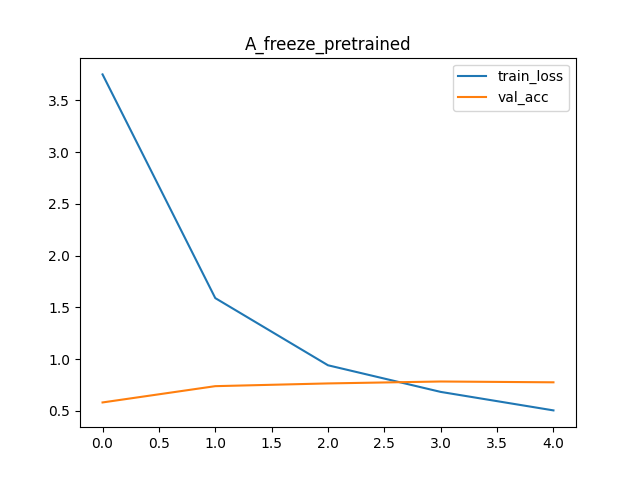
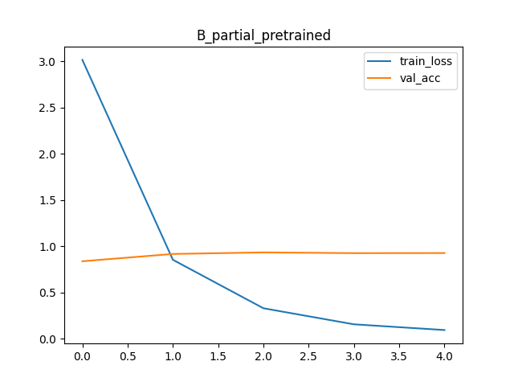
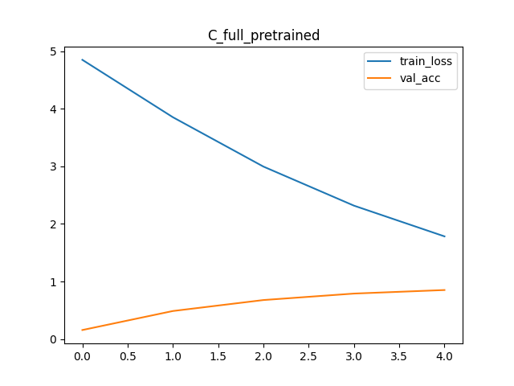
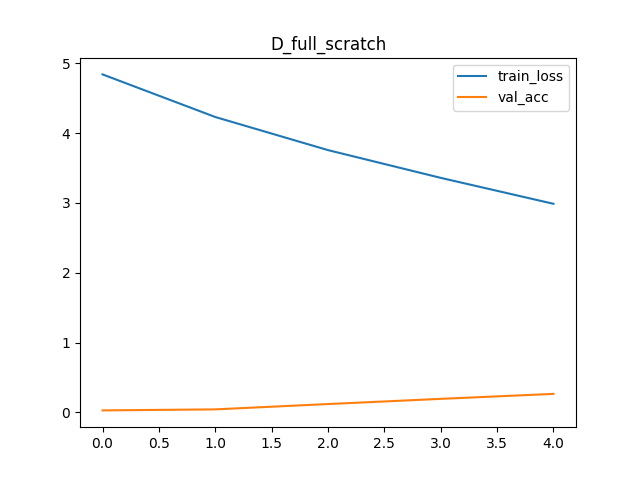

# 🧠 Image Classification with Transfer Learning

## 📌 1. Overview

This project addresses an image classification task by comparing multiple training strategies based on **pretrained models and fine-tuning techniques**.

A **Streamlit-based interactive web application** is also implemented to visualize model predictions, allowing users to explore results intuitively.

---

## 🎯 2. Objectives

* Compare performance across different training strategies (pretrained vs. scratch, fine-tuning levels)
* Analyze training behavior using learning curves
* Provide an interactive UI for real-time inference

---

## 🧩 3. Model Configuration

We use **ResNet34** as the backbone architecture.

Four experimental settings are defined:

| Model | Pretrained | Fine-tuning Strategy | Description                                |
| ----- | ---------- | -------------------- | ------------------------------------------ |
| A     | Yes        | Freeze               | Only the final FC layer is trained         |
| B     | Yes        | Partial              | Last residual block + FC layer are trained |
| C     | Yes        | Full                 | Entire network is fine-tuned               |
| D     | No         | Full                 | Trained from scratch                       |

---

## 🗂️ 4. Dataset

* Total images: XXXX
* Number of classes: XXXX

The dataset follows the `ImageFolder` structure:

```
data/
├── class1/
│   ├── img1.jpg
│   ├── img2.jpg
├── class2/
│   ├── ...
```

Each folder represents a class, and all images inside are treated as samples of that class.

---

### 🔹 Data Splitting

The dataset is **automatically split within the code** using random sampling:

* Training set: 70%
* Validation set: 15%
* Test set: 15%

A fixed random seed is used to ensure reproducibility:

* Seed: 42

---

## ⚙️ 5. Training Setup

* Device: CPU
* Epochs: 5
* Batch size: 16
* Optimizer: Adam
* Loss function: CrossEntropyLoss
* Input size: 224 × 224

---

## 📊 6. Experimental Results

### 🔹 Performance Comparison

Model performance was evaluated and compared primarily using classification accuracy, as it provides the most intuitive measure of prediction correctness.

| Model | Validation Accuracy | Test Accuracy |
| ----- | ------------------- | ------------- |
| A     | 0.7761485826001955  | 0.79765395894 |
| B     | 0.9266862170087976  | 0.92766373411 |
| C     | 0.8514173998044966  | 0.86217008797 |
| D     | 0.2658846529814271  | 0.24633431085 |

---

### 🔹 Learning Curves

#### Model A



#### Model B



#### Model C



#### Model D



---

## 🔍 7. Analysis

### ✔ Pretrained vs. Scratch

Models initialized with pretrained weights consistently outperform the model trained from scratch.
This demonstrates that pretrained networks already capture useful low-level and mid-level visual features.

---

### ✔ Fine-tuning Strategies

* **Partial fine-tuning (Model B)** provides the best balance between performance and generalization.
* The freeze strategy (Model A) is computationally efficient but limited in representational flexibility.
* Full fine-tuning (Model C) can achieve strong performance but is more sensitive to overfitting, especially with limited data.

---

### ✔ Effect of Dataset Size

Because the dataset is relatively small, training from scratch (Model D) results in significantly lower performance.
This highlights the importance of transfer learning in data-constrained environments.

---

## 🖥️ 8. Streamlit Demo

A Streamlit-based interface is implemented for interactive inference.

### Features

* Model selection
* Image upload (drag & drop supported)
* Top-5 prediction results
* Class representative images for intuitive comparison
* Probability visualization using a bar chart

---

## ▶️ How to Run

### 1. Train Models

```
python train.py
```

### 2. Run Web Application

```
streamlit run app.py
```

---

## 📌 9. Conclusion

* Transfer learning significantly improves performance in image classification tasks.
* Fine-tuning strategy plays a crucial role in model effectiveness.
* Partial fine-tuning achieves the best trade-off between accuracy and generalization in this setup.

---

## 🚀 10. Future Work

* Apply more advanced data augmentation techniques
* Experiment with deeper architectures (e.g., ResNet50, EfficientNet)
* Implement ensemble methods
* Compare inference latency across models
